# Photonics 0.3.4 → Minecraft 1.21.1 Backport

> **Maintainer help wanted:** the backport now builds, loads, and reaches the Photonics rendering pipeline on Fabric 1.21.1, but several failures appear to involve voxel-model suppression, handheld-light registration, and unstable ReSTIR/history state. I have taken the compatibility work as far as I can without deeper knowledge of the original rendering architecture.

This is a standalone backport of the published Photonics `0.3.4` release from Minecraft `1.21.11` to `1.21.1`. It was reconstructed from the published JAR because the current upstream `multi-version` branch has since moved to a different, multi-module architecture.

## Start Here: Runtime Video

### [▶ Watch the 56-second production test](docs/backport_evidence/2026-07-30/17_runtime_flickering_and_crosshair_darkening.mp4)

The video captures three of the most disruptive problems in one run:

- tall-grass shadow flickering while the camera moves;
- intermittent full-scene flashes where geometry briefly appears to reload or become transparent;
- underground blocks changing brightness when the crosshair passes over them.

## Problems at a Glance

| Area | Observed behavior |
| --- | --- |
| Voxel-rendered blocks | Copper ore and other configured blocks disappear from the scene. |
| Handheld lighting | A held lantern produces only a faint brightness change, with no clear ray-traced shadows. |
| Enclosed lighting | A completely sealed cave remains visibly illuminated. |
| Frame stability | The scene periodically flashes, briefly exposing geometry through the world. |
| ReSTIR/history state | `Indirect`, `ReSTIR State`, `GPU Uniform State`, and `Direct Raw` change abruptly after a flash. |
| Crosshair interaction | Underground block shading changes when targeted. |
| BSL compatibility | Tall-grass shadows flicker and begin noticeably away from the grass base. |

## What Was Backported

### Project and dependency work

- Rebuilt the published `0.3.4` release as a standalone Fabric Loom project targeting Minecraft `1.21.1` and Java 21.
- Locked compatible versions of Fabric Loader, Fabric API, Sodium, Iris, Mod Menu, and BSL.
- Adapted version-sensitive Minecraft model, renderer, resource, and chunk-meshing signatures.
- Added validation for critical mixin registrations and dependency-sensitive descriptors.

### Iris and Sodium integration

- Updated Iris composite-pass interception, framebuffer binding, and program binding for the 1.21.1-compatible dependency set.
- Updated Sodium shader integration for the available constructor, sampler, image, and chunk-meshing APIs.
- Isolated runtime code from invalid direct calls into mixin classes.
- Added bounded warnings when expected shader-patch anchors are absent.

### Shader and temporal-rendering work

- Adapted BSL `10.1.3` entity output layouts for `DRAWBUFFERS:018367` and `DRAWBUFFERS:01367`.
- Added fallback diagnostics around custom voxel rendering.
- Repaired parts of the ReSTIR pass graph, light bounds, temporal uniforms, framebuffer separation, and history invalidation.
- Added diagnostic views for the principal composition, geometry, lighting, and temporal-state buffers.
- Added regression tests for shader replacement, MagicaVoxel decoding, and temporal state.

## Test Setup

| Component | Version |
| --- | --- |
| Minecraft | `1.21.1` |
| Fabric Loader | `0.18.4` |
| Fabric API | `0.116.13+1.21.1` |
| Sodium | `mc1.21.1-0.8.12-beta.2-fabric` |
| Iris | `1.8.14-beta.1+1.21.1-fabric` |
| Mod Menu | `11.0.2` |
| Shader pack | BSL `10.1.3` |

The production test used ReSTIR mode with 32 initial samples, 5 spatial-reuse samples, 32 accumulation frames, 5 denoiser passes, and separate handheld rays enabled.

`gradlew clean check build` succeeds. The remapped test artifact is:

```text
photonics-backport-0.3.4+1.21.1.jar
SHA-256: 562435f104c3ea07e71c955122a38ee2c5eb1b034299b070839baee7faa3216c
```

Visual testing was performed in a normal production Minecraft installation. Loom `runClient` is not usable as a rendering gate with this dependency combination because the published Iris `1.8.14-beta.1` JAR lacks the named `iris-fabric.refmap.json` expected during development-namespace selector remapping.

## Current Rendering Problems

### 1. Configured voxel blocks disappear

Copper ore and potentially other blocks selected for custom voxel rendering are invisible in the composed scene. This looks consistent with the normal Sodium model being suppressed before a usable voxel representation is available, but that root cause is not confirmed.

### 2. Handheld lights do not produce recognizable ray-traced lighting

A lantern in the player's hand causes a very subtle increase in nearby brightness. It does not cast the occluded, directional shadows expected from a ray-traced source, so the handheld voxel geometry cannot be evaluated visually.

The ground lantern remains at the left side of the scene throughout the diagnostic sequence. In the `Handheld` view, the player is also holding a lantern.

### 3. Sealed caves receive unexplained light

With no held light and no opening to the sky, faces inside a completely sealed cave remain clearly visible. It is not yet clear whether this comes from BSL base composition, stale Photonics history, or another lighting path.

### 4. The scene flashes and briefly exposes geometry

Every few seconds, the frame can flash as though renderer state or world geometry is being reloaded. During the flash, normally hidden geometry may become visible through the world.

The flashes correlate with large changes in multiple diagnostic views, even when the camera and settings remain fixed.

### 5. Lighting and state buffers change abruptly

After a flash:

- `Indirect` can suddenly become much darker;
- `ReSTIR State` changes from mostly red to yellow/white;
- `GPU Uniform State` changes from cyan to almost white;
- `Direct Raw` briefly gains better-looking scene shading, then returns to its earlier state after roughly one or two seconds.

### 6. Crosshair position changes underground shading

The video shows underground block faces darkening as the crosshair moves over them. The behavior is repeatable and appears tied to targeting rather than a change in the scene's light sources.

### 7. Tall-grass shadows flicker and do not meet the grass base

Camera movement causes noticeable flickering around tall grass. The shadow also begins away from the bottom of the grass, leaving a visible gap.

Direct-sun shadows in this integration are expected to remain BSL shadow-map output rather than Photonics ray-traced shadows. This may therefore be a BSL compatibility problem rather than a Photonics path-tracing problem, but it is included because it is especially unstable in the current test setup.

## Diagnostic Gallery

Click any image to open it at full size.

### Composition and geometry

| Combined | BSL Base |
| --- | --- |
| [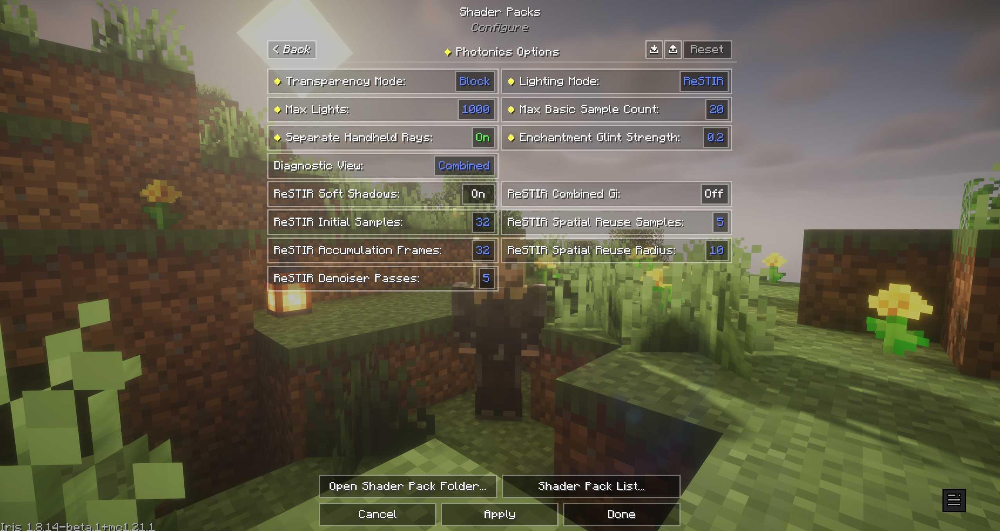](docs/backport_evidence/2026-07-30/01_combined.png) | [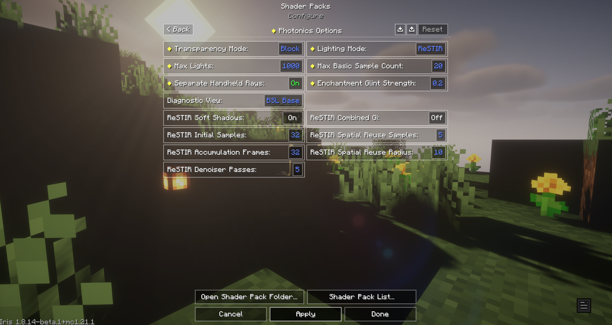](docs/backport_evidence/2026-07-30/02_bsl_base.png) |
| Final composed view. | BSL contribution before Photonics composition. |

| Albedo | Geometric Normal |
| --- | --- |
| [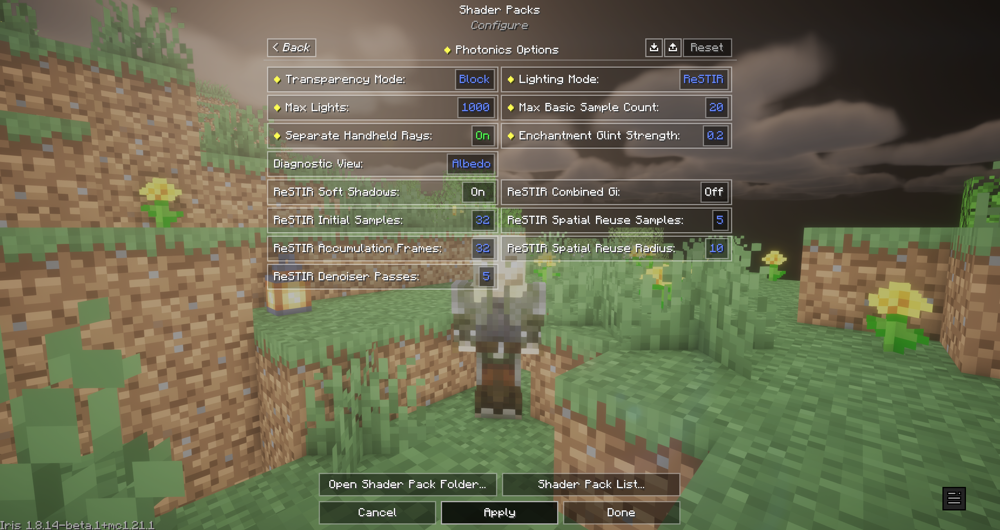](docs/backport_evidence/2026-07-30/03_albedo.png) | [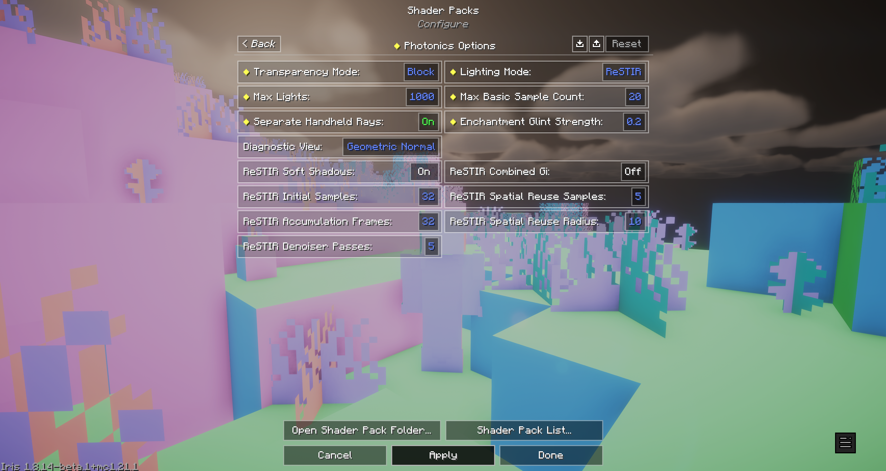](docs/backport_evidence/2026-07-30/04_geometric_normal.png) |
| Surface color input. | Geometry-normal input. |

| Direct | Handheld |
| --- | --- |
| [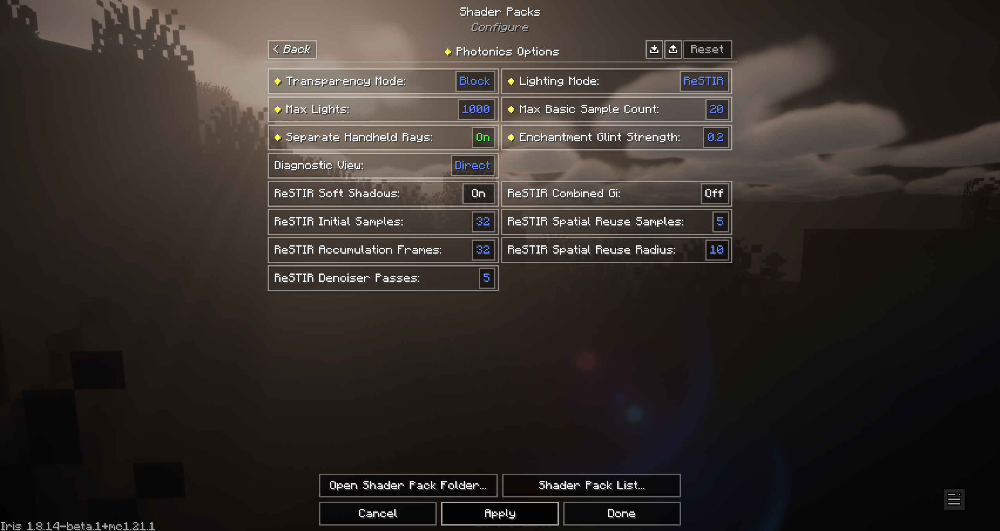](docs/backport_evidence/2026-07-30/05_direct.png) | [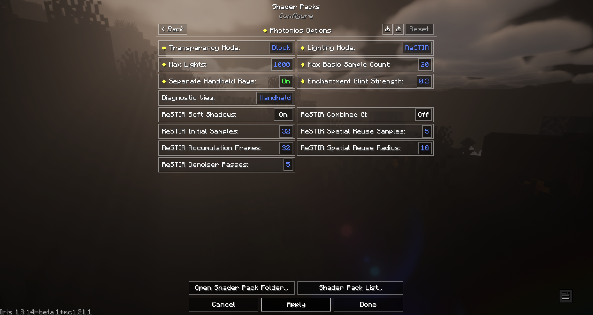](docs/backport_evidence/2026-07-30/08_handheld_with_lantern.png) |
| Direct-light contribution. | A lantern is in the player's hand, but no recognizable handheld shadowing is visible. |

### Indirect lighting changes

| Initial | After the shaded areas suddenly darkened |
| --- | --- |
| [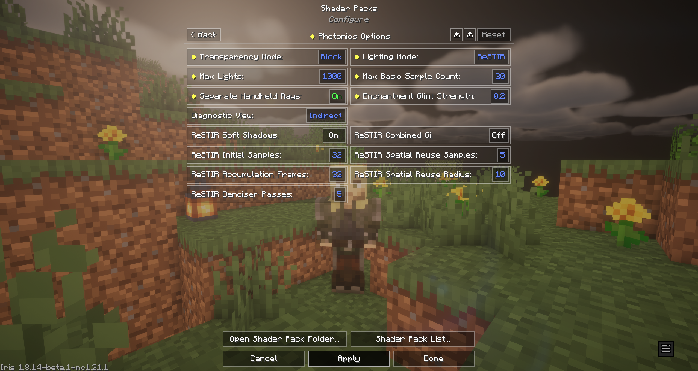](docs/backport_evidence/2026-07-30/06_indirect_initial.png) | [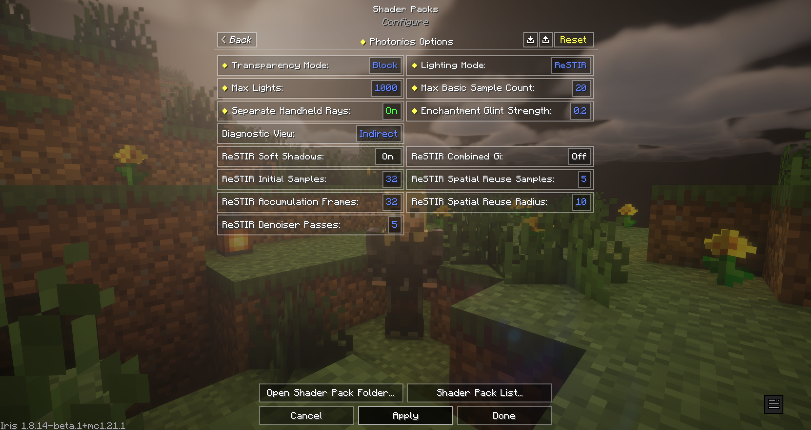](docs/backport_evidence/2026-07-30/07_indirect_after_darkening.png) |

### ReSTIR state changes

| Immediately after selecting the view | After two flashes |
| --- | --- |
| [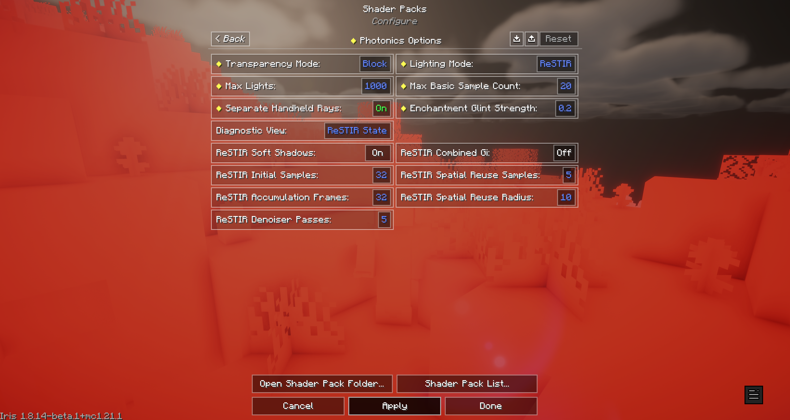](docs/backport_evidence/2026-07-30/09_restir_state_initial.png) | [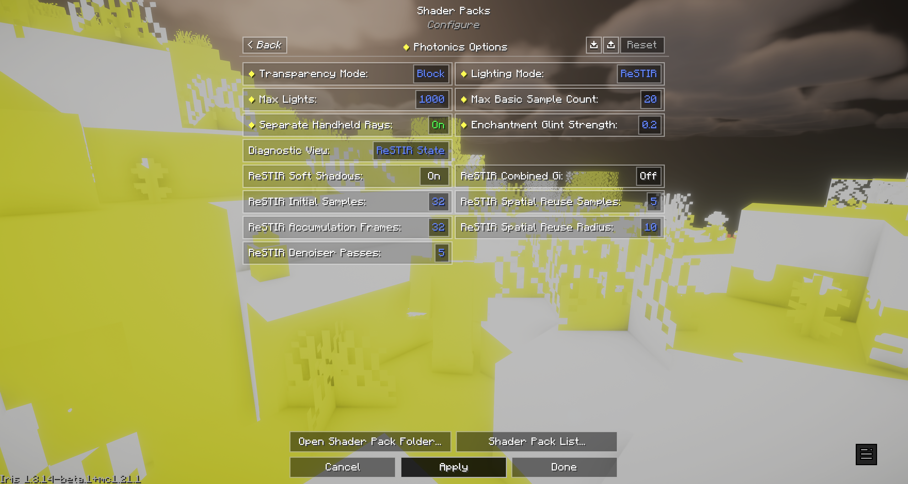](docs/backport_evidence/2026-07-30/10_restir_state_after_flickers.png) |

### GPU uniform state changes

| Immediately after selecting the view | After a flash |
| --- | --- |
| [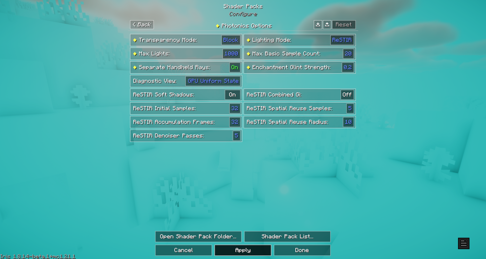](docs/backport_evidence/2026-07-30/11_gpu_uniform_state_initial.png) | [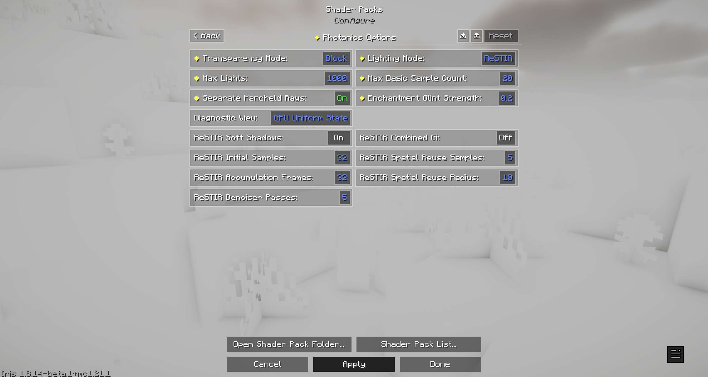](docs/backport_evidence/2026-07-30/12_gpu_uniform_state_after_flicker.png) |

### Direct Raw changes

| Immediately after selecting the view | After a flash |
| --- | --- |
| [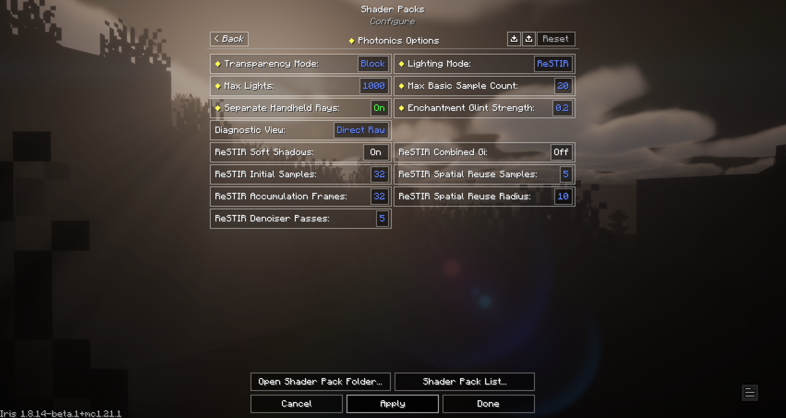](docs/backport_evidence/2026-07-30/13_direct_raw_initial.png) | [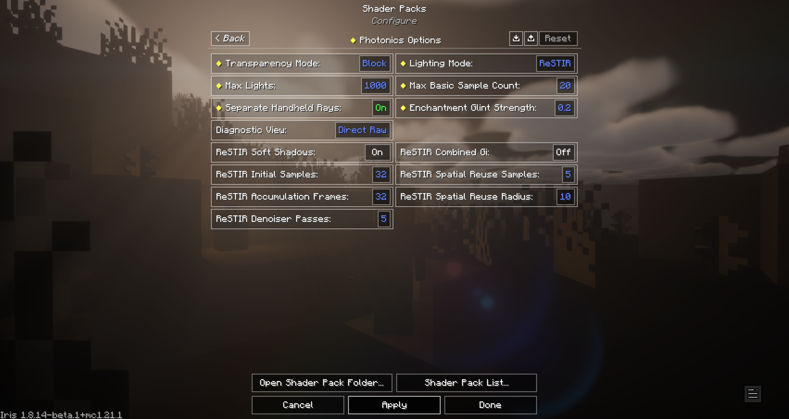](docs/backport_evidence/2026-07-30/14_direct_raw_after_flicker.png) |
| Initial state. | The shading looks better here, but only for roughly one or two seconds before reverting. |

### Scene-level failures

| Sealed cave | Tall-grass shadow offset |
| --- | --- |
| [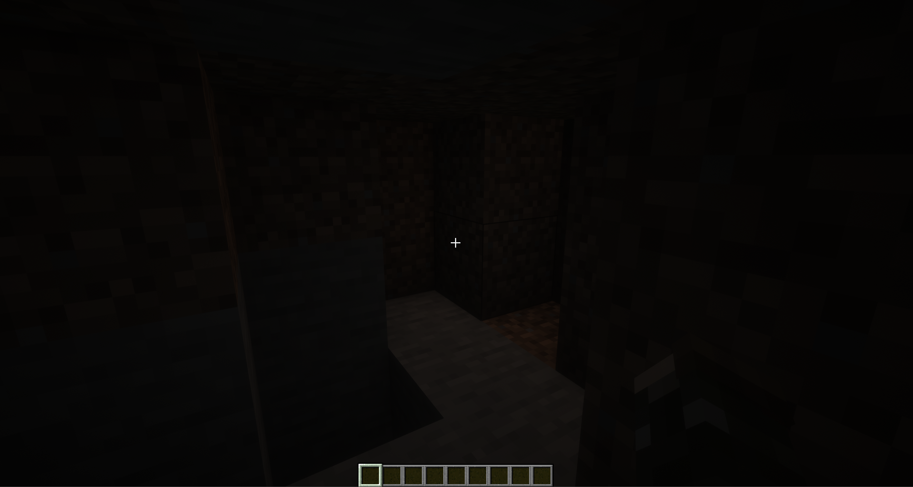](docs/backport_evidence/2026-07-30/15_sealed_cave_unexpected_light.png) | [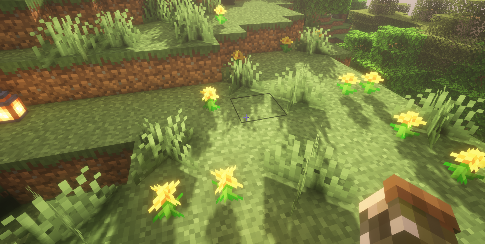](docs/backport_evidence/2026-07-30/16_bsl_grass_shadow_offset.png) |
| This cave is completely enclosed and should be pitch black. | The visible gap shows that the shadow does not begin at the grass base. |

## Questions for the Maintainer

1. In the `0.3.4` architecture, what readiness or allocation condition should control suppression of the normal Sodium model for configured voxel blocks?
2. Which renderer or resource-reload lifecycle event should invalidate ReSTIR history, state textures, and diagnostic buffers? The full-frame flashes consistently correlate with large diagnostic-state changes.
3. What is the expected `0.3.4` registration and visibility path for a held block light? The lantern appears to be recognized weakly, but the `Handheld` contribution does not show expected occlusion or shadowing.
4. Should any nonzero BSL base contribution survive in a completely sealed cave, or should Photonics composition explicitly reject it?
5. Could the crosshair-dependent underground darkening indicate a known history/depth mismatch, or is an incorrect 1.21.1 uniform or framebuffer adaptation more likely?

Any direction on these five areas would be more useful than further speculative compatibility changes.
